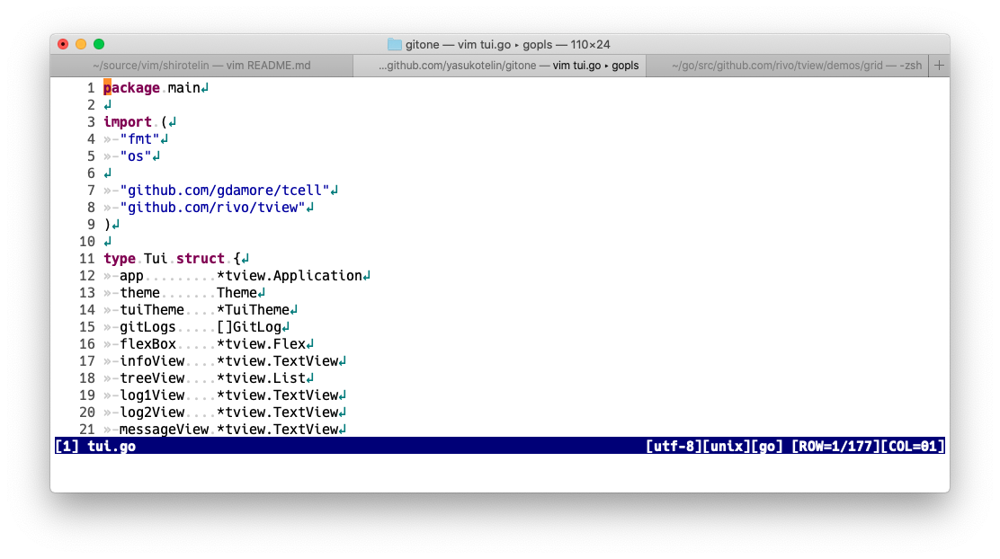
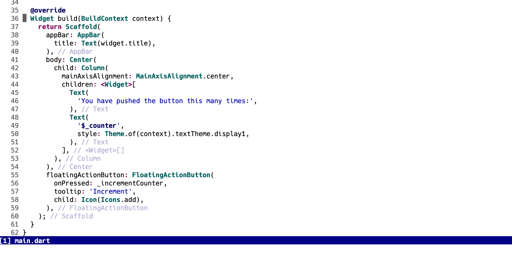
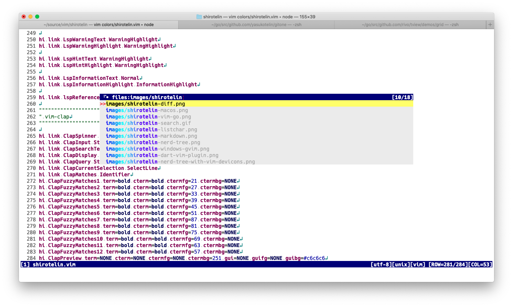

<p align="center">
    
    <h2 align="center">shirotelin</h2>
    <p align="center">shirotelin is Ultimate standard light colorscheme for Vim and Neovim!</p>
</p>


---

<br>

- Supports Windows, macOS and Linux!
- Supported CUI and GUI.

<table>
    <tr>
        <th>NeoVim (MacOS)</th>
    </tr>
    <tr>
        <td></td>
    </tr>
    <tr>
        <th>GVim (Windows)</th>
    </tr>
    <tr>
        <td></td>
    </tr>
</table>

## shirotelin family!

- for Terminal.app ([yasukotelin/shirotelin-terminal-app](https://github.com/yasukotelin/shirotelin-terminal-app))
- for JetBrains IDE ([yasukotelin/shirotelin-intellij](https://github.com/yasukotelin/shirotelin-intellij))
- for Visual Studio Code ([yasukotelin/shirotelin-vscode](https://github.com/yasukotelin/shirotelin-vscode))
- for Kakoune ([esessoms/shirotelin-kakoune](https://github.com/esessoms/shirotelin-kakoune))
- for Emacs ([esessoms/shirotelin-theme](https://github.com/esessoms/shirotelin-theme))

## Supported Plugins Color⛏

- [✔] Markdown https://github.com/plasticboy/vim-markdown
- [✔] NERDTree https://github.com/preservim/nerdtree
- [✔] NERDTree + vim-devicons https://github.com/ryanoasis/vim-devicons
- [✔] dart-vim-plugin https://github.com/dart-lang/dart-vim-plugin
- [✔] vim-lsp https://github.com/prabirshrestha/vim-lsp
- [✔] coc.nvim https://github.com/neoclide/coc.nvim
- [✔] coc-flutter https://www.npmjs.com/package/coc-flutter
- [✔] vim-go https://github.com/fatih/vim-go
- [✔] vim-clap https://github.com/liuchengxu/vim-clap

## Install

If you use any vim plugin manager, refer to the following.

**vim-plug**

```vim
Plug 'yasukotelin/shirotelin'
```

**dein.vim**

```vim
call dein#add('yasukotelin/shirotelin')
```

**Manual Install**

If you want to manual install, you download `colors/shirotelin.vim` and puts on your `~/.vim/colors` directory.

Finally, Write to your `.vimrc` or `init.vim`.

```vimrc
colorscheme shirotelin
```

## Settings

If you want to show the Tab, white space, and EOL, you write a like below to `.vimrc` or `init.vim`.
shirotelin shows nice them.

```
set list
set listchars=tab:»-,eol:↲,extends:»,precedes:«,space:.
```



If you want to show the cursorline, you write this.
shirotelin's cursorline is underline.

```
set cursorline
```

You doesn't want to show the cursorline. You write this.

```
set nocursorline
```

## Screenshots

### Complete

Complete and popup are simple and classical color 😍


### TODO

TODO is highlighted with background Green.


### Diff

Supported diff color 🤷‍♂️


## Supported Plugins

I add colors for plugins actively.

### Markdown

https://github.com/plasticboy/vim-markdown


### NERDTree

https://github.com/scrooloose/nerdtree


#### with vim-devicons

https://github.com/ryanoasis/vim-devicons


### dart-vim-plugin

https://github.com/dart-lang/dart-vim-plugin


### coc.nvim

Supported for [coc.nvim](https://github.com/neoclide/coc.nvim).<br>


### coc-flutter

Supported for Closing Label on the [coc-flutter](https://www.npmjs.com/package/coc-flutter)

> **NOTE** Closing Label is supported on only Neovim.



### vim-go

Supported for [vim-go](https://github.com/fatih/vim-go)

> **NOTE** vim-go default config is a less highlited. If you want to more highlight, you can refer vim-go WIKI pages and setting them.


### vim-clap

Supported for [vim-clap](https://github.com/liuchengxu/vim-clap)



## Licence

MIT Licence

## Author

yasukotelin
